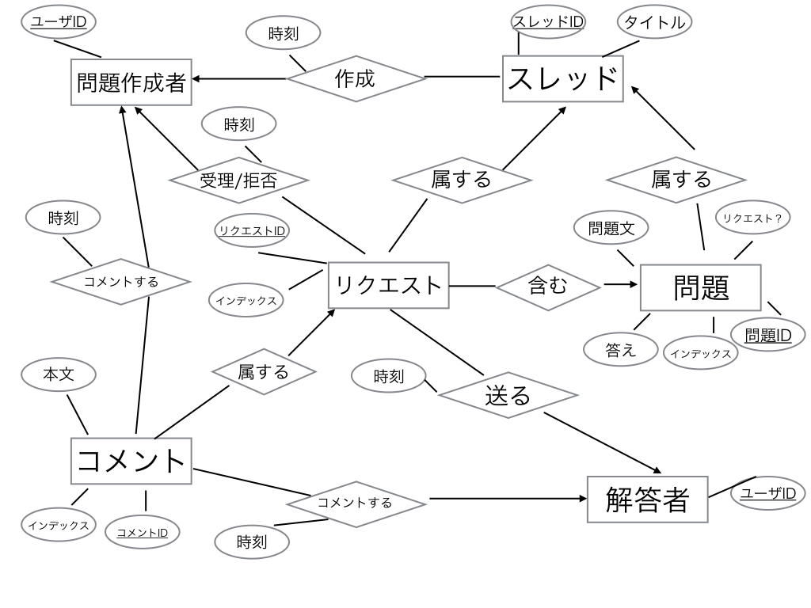

# 計算機科学実験及演習4 データベース 課題1
#### 1029259152 田中 勝也
## 1. アプリケーションの説明

今回想定するアプリケーションは問題投稿ウェブサイトである.

問題作成者ははじめに, 問題の集合となるスレッドを作成し,
スレッドに問題を追加していく.

解答者はスレッドを閲覧し問題を解くことができるほか,
スレッドに追加して欲しい問題を問題投稿者に申請したりすることができる.

ユーザはその時々で問題作成者にも解答者にもなることができる.

## 2. 利用者の役割の列挙と説明

- 問題作成者

    主に問題を作成するという役割をもつ.

- 解答者

    主に問題作成者が作成した問題に答える役割をもつ.

## 3. 役割ごとの機能の列挙と説明

- 問題作成者

    - スレッド作成/編集/削除

        問題を作成するためのもととなるスレッドを作成する. 問題作成で作成する問題はスレッドに属する.

    - 問題作成/編集/削除

        スレッドに問題を追加および, 追加された問題を編集/削除する.

    - 問題追加リクエストを承認する/閉じる

        回答者からスレッドに対して送られてきた問題追加リクエストを承認/拒否する.

    - 問題追加リクエストにコメントする

        回答者からスレッドに対して送られてきた問題追加リクエストに対して, コメントを加える.

    - 自分が作成したスレッド一覧を確認する

- 解答者

    - スレッド一覧確認

        投稿されているスレッドの一覧を確認する.

    - 問題閲覧/解答

        スレッドを選択し, それに追加されている問題を閲覧し, 解答する.

    - 問題追加リクエストを送る

        スレッドに対して, 追加して欲しい問題をリクエストする.

    - 問題追加リクエストにコメントする

        問題追加リクエストに対して, コメントを加える.

## 4. 実体関連図とその説明(各実体集合および関連集合の説明)

- 実体集合と関連集合

    - 問題作成者

        ユーザID を属性として持つ. メインキーはユーザID. スレッドを作成し, リクエストを承認する/拒否することを決定し, リクエストにコメントする.

    - スレッド

        スレッドID, タイトルを属性として持つ. メインキーはスレッドID. 問題とリクエストが属しており, 問題作成者により作成される.

    - 問題

        問題文, 答え, インデックス, リクエスト? を属性として持ち, スレッドに属している.

        リクエスト? はその問題がリクエストとして送られているのかどうかを表す.

    - リクエスト

        インデックスを属性として持ち, スレッドに属しており, 問題を含む. コメントが属している.

    - 解答者

        ユーザIDを属性として持つ. メインキーはユーザID. スレッドに問題追加リクエストを送ったり, リクエストにコメントする.

    - コメント

        本文とインデックスを属性として持ち, リクエストに属する. リクエストに対する意意見, 修正案などを書き込むために存在する.
