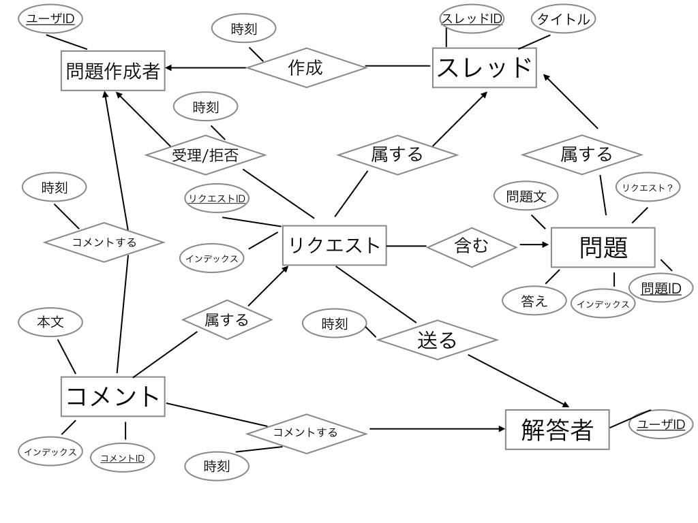

# 計算機科学実験及演習4 データベース 課題2
#### 1029259152 田中 勝也
## 課題１で作成したER図について，関数従属性の集合および自明でない多値従属性の集合を求めなさい．もしこれらの集合が存在しなければ，存在するようにER図を変更すること．各従属性がなぜ成立するのかを文章で説明すること．

今回は以下のER図について成立する関数従属性, 多値従属性について考える.

### 関数従属性

考えられる関数従属性を以下に列挙した.

- スレッドID $\rightarrow$ タイトル

    スレッドID を決めればスレッドのタイトルは一意に定まる.

- 問題ID $\rightarrow$ インデックス

    問題ID を決めればインデックスは一意に定まる.

- 問題ID $\rightarrow$ 問題文

    問題ID を決めれば問題文は一意に定まる.

- 問題ID $\rightarrow$ 答え

    問題ID を決めれば答えは一意に定まる.

- 問題ID $\rightarrow$ リクエスト？

    問題ID を決めればその問題がリクエストに含まれているかどうかは一意に定まる.

- 問題文 $\rightarrow$ 答え

    問題文を決めれば答えは一意に定まる.

- リクエストID $\rightarrow$ インデックス

    リクエストID を決めればインデックスは一意に定まる.

- コメントID $\rightarrow$ インデックス

    コメントID を決めればインデックスは一意に定まる.

- コメントID $\rightarrow$ 本文

    コメントID を決めれば本文は一意に定まる.

- ユーザID(問題作成者) $\cup$ スレッドID $\rightarrow$ 時刻(作成)

    ユーザID(問題作成者)とスレッドID を決めればスレッド作成時刻は一意に定まる.

- ユーザID(問題作成者) $\cup$ リクエストID $\rightarrow$ 時刻(受理/拒否)

    ユーザID(問題作成者)とリクエストID を決めればリクエストが受理/拒否された時刻は一意に定まる.

- ユーザID(問題作成者) $\cup$ コメントID $\rightarrow$ 時刻(コメントする)

    ユーザID(問題作成者)とコメントID が決まればコメントされた時刻は一意に定まる.

- ユーザID(解答者) $\cup$ リクエストID $\rightarrow$ 時刻(送る)

    ユーザID(解答者)とリクエストID が決まればリクエストが送信された時刻は一意に定まる.

- ユーザID(解答者) $\cup$ コメントID $\rightarrow$ 時刻(コメントする)

    ユーザID(解答者)とコメントID が決まればコメントされた時刻は一意に定まる.

### 多値従属性

考えられる多値従属性として,

- ユーザID(解答者) \rightarrow\rightarrow ユーザID(問題作成者) | スレッドID
- ユーザID(解答者) \rightarrow\rightarrow ユーザID(問題作成者) | 問題ID
- ユーザID(解答者) \rightarrow\rightarrow ユーザID(問題作成者) | コメントID
- ユーザID(解答者) \rightarrow\rightarrow ユーザID(問題作成者) | リクエストID
- ユーザID(解答者) \rightarrow\rightarrow スレッドID | 問題ID
- ユーザID(解答者) \rightarrow\rightarrow スレッドID | コメントID
- ユーザID(解答者) \rightarrow\rightarrow スレッドID | リクエストID
- ユーザID(解答者) \rightarrow\rightarrow 問題ID | コメントID
- ユーザID(解答者) \rightarrow\rightarrow 問題ID | リクエストID
- ユーザID(解答者) \rightarrow\rightarrow コメントID | リクエストID
- ユーザID(問題作成者) \rightarrow\rightarrow ユーザID(解答者) | スレッドID
- ユーザID(問題作成者) \rightarrow\rightarrow ユーザID(解答者) | 問題ID
- ユーザID(問題作成者) \rightarrow\rightarrow ユーザID(解答者) | コメントID
- ユーザID(問題作成者) \rightarrow\rightarrow ユーザID(解答者) | リクエストID
- ユーザID(問題作成者) \rightarrow\rightarrow スレッドID | 問題ID
- ユーザID(問題作成者) \rightarrow\rightarrow スレッドID | コメントID
- ユーザID(問題作成者) \rightarrow\rightarrow スレッドID | リクエストID
- ユーザID(問題作成者) \rightarrow\rightarrow 問題ID | コメントID
- ユーザID(問題作成者) \rightarrow\rightarrow 問題ID | リクエストID
- ユーザID(問題作成者) \rightarrow\rightarrow コメントID | リクエストID
- スレッドID \rightarrow\rightarrow ユーザID(解答者) | ユーザID(問題作成者)
- スレッドID \rightarrow\rightarrow ユーザID(解答者) | 問題ID
- スレッドID \rightarrow\rightarrow ユーザID(解答者) | コメントID
- スレッドID \rightarrow\rightarrow ユーザID(解答者) | リクエストID
- スレッドID \rightarrow\rightarrow ユーザID(問題作成者) | 問題ID
- スレッドID \rightarrow\rightarrow ユーザID(問題作成者) | コメントID
- スレッドID \rightarrow\rightarrow ユーザID(問題作成者) | リクエストID
- スレッドID \rightarrow\rightarrow 問題ID | コメントID
- スレッドID \rightarrow\rightarrow 問題ID | リクエストID
- スレッドID \rightarrow\rightarrow コメントID | リクエストID
- 問題ID \rightarrow\rightarrow ユーザID(解答者) | ユーザID(問題作成者)
- 問題ID \rightarrow\rightarrow ユーザID(解答者) | スレッドID
- 問題ID \rightarrow\rightarrow ユーザID(解答者) | コメントID
- 問題ID \rightarrow\rightarrow ユーザID(解答者) | リクエストID
- 問題ID \rightarrow\rightarrow ユーザID(問題作成者) | スレッドID
- 問題ID \rightarrow\rightarrow ユーザID(問題作成者) | コメントID
- 問題ID \rightarrow\rightarrow ユーザID(問題作成者) | リクエストID
- 問題ID \rightarrow\rightarrow スレッドID | コメントID
- 問題ID \rightarrow\rightarrow スレッドID | リクエストID
- 問題ID \rightarrow\rightarrow コメントID | リクエストID
- コメントID \rightarrow\rightarrow ユーザID(解答者) | ユーザID(問題作成者)
- コメントID \rightarrow\rightarrow ユーザID(解答者) | スレッドID
- コメントID \rightarrow\rightarrow ユーザID(解答者) | 問題ID
- コメントID \rightarrow\rightarrow ユーザID(解答者) | リクエストID
- コメントID \rightarrow\rightarrow ユーザID(問題作成者) | スレッドID
- コメントID \rightarrow\rightarrow ユーザID(問題作成者) | 問題ID
- コメントID \rightarrow\rightarrow ユーザID(問題作成者) | リクエストID
- コメントID \rightarrow\rightarrow スレッドID | 問題ID
- コメントID \rightarrow\rightarrow スレッドID | リクエストID
- コメントID \rightarrow\rightarrow 問題ID | リクエストID
- リクエストID \rightarrow\rightarrow ユーザID(解答者) | ユーザID(問題作成者)
- リクエストID \rightarrow\rightarrow ユーザID(解答者) | スレッドID
- リクエストID \rightarrow\rightarrow ユーザID(解答者) | 問題ID
- リクエストID \rightarrow\rightarrow ユーザID(解答者) | コメントID
- リクエストID \rightarrow\rightarrow ユーザID(問題作成者) | スレッドID
- リクエストID \rightarrow\rightarrow ユーザID(問題作成者) | 問題ID
- リクエストID \rightarrow\rightarrow ユーザID(問題作成者) | コメントID
- リクエストID \rightarrow\rightarrow スレッドID | 問題ID
- リクエストID \rightarrow\rightarrow スレッドID | コメントID
- リクエストID \rightarrow\rightarrow 問題ID | コメントID

が存在する. これらは全てER図中の実体の主キーであり, すべての実体は独立に存在しているため, これらの多値従属性が存在する.
